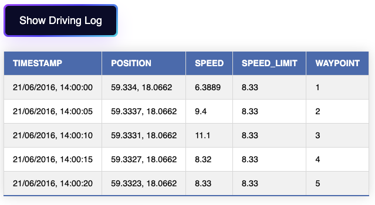
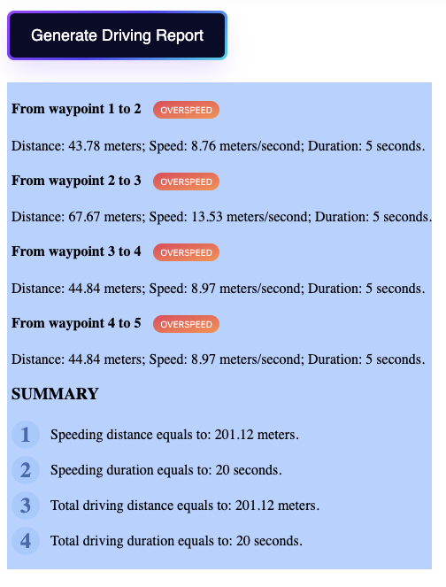

# DrivingReport

1. Implementation
- Load JSON file to a table and show it on a web page. 
    - Press button to show the driving log.
    - Load waypoints data into table content.
    - Convert timestamp to human-friendly format.
    - Add index column for table. 
    - Style the table and button.

    
- Categorise driving records and generate a driving report. 
    - Press button to show the report. 
    - Calcutate the distance of two waypoints based on coordinate of latitude and longitude. 
    - Calcutate the interval between each waypoint. 
    - Calculate speed by distance/time-interval and compare with speed limit, categorise the result. 
    - Set a overspeed flag when speed is over speed limit. 
    - Generate final report, show how well the user (Peter Griffin) stick to the speed limits while driving.

    
- Unit test, use [JEST](https://jestjs.io/) framework. 
    - Test function calculateDist().
    - Test function calculateReport().
        - Using mocked implementation of calculateDist().
2. Running this program locally has two ways: 
- 
    ```
    npm install
    npm start
    npm test
    ``` 
- Or view index.html with [Live Server Extension](https://marketplace.visualstudio.com/items?itemName=ritwickdey.LiveServer) if you use VS Code.  

3. Potential features.
- Integrate with google map API, show driving history on the map. 
- Calculate score based on the driver's ability to drive safely, eg. how close to the speed limit, how often he drives over the speed limit. 
- Generate driving report in csv or other format. 

4. Reference
- [Convert JSON to Table](https://www.encodedna.com/javascript/practice-ground/default.htm?pg=convert_json_to_table_javascript).
- [Calculate distance based on latitude and longitude](https://www.geodatasource.com/developers/javascript).
- [Button Style](https://getcssscan.com/css-buttons-examples).
- Jest [mock functions](https://jestjs.io/docs/mock-function-api#mockfnmockimplementationfn).
